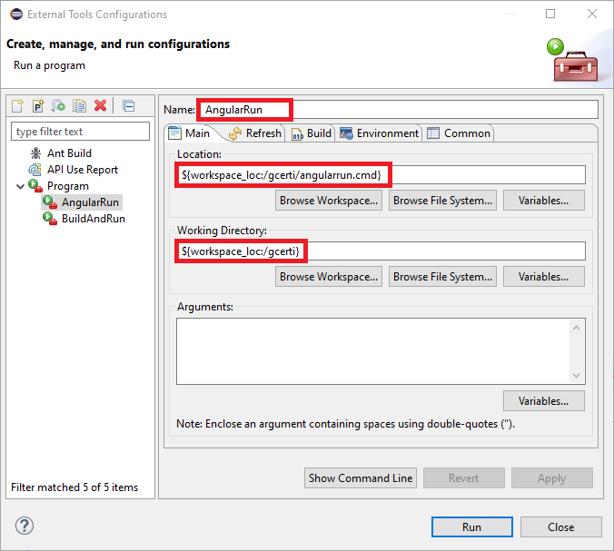

## Docker 
1) Generare tutti gli artefatti

2) Eseguire ```mvn install```

3) Compilazione

Automatica

	Eseguire il bat buildNdeploy.bat dalla directory del progetto

In locale
	
	docker-compose build

Per push in remoto

	docker-compose -f ./docker-push.yml build
	docker-compose -f ./docker-push.yml push


4) Eseguire 

In locale
 
	docker stack deploy -c docker-compose.yml prova (``` docker stack rm prova`` per rimuovere lo stack).

Per pull

	docker stack deploy -c docker-pull.yml prova


##Spring Boot Admin

Per accedere all'interfaccia Spring Boot Admin recarsi al path:

http://{url}:{port}/admin/

Es: http://localhost:8015/admin/

Username di default:
admin

Password di default:
admin


##Esecuzione applicazione da Server Tomcat

Aggiungere la seguente variabile per settare lo spring profile nel tab "Arguments" della "Launch configuration" di tomcat (Doppio click sul server -> Open Launch configuration"). 

-Dspring.profiles.active="prod"


##Build da Eclipse

Da Eclipse raggiungere la configurazione per utilizzare tool esterni di build


Configurare lo script build and run.cmd valorizzando i campi come in immagine


Cliccare "Apply" e poi "Run"

Stessa procedura per Angular


